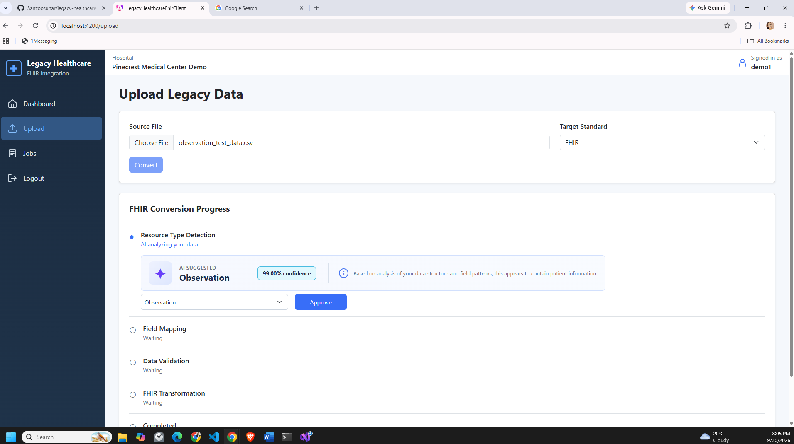
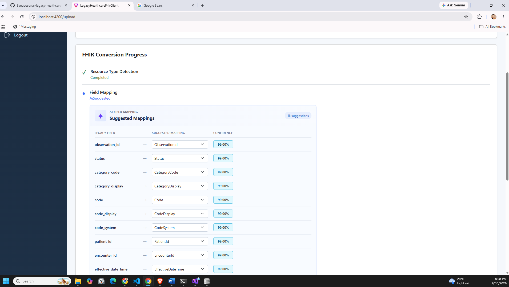
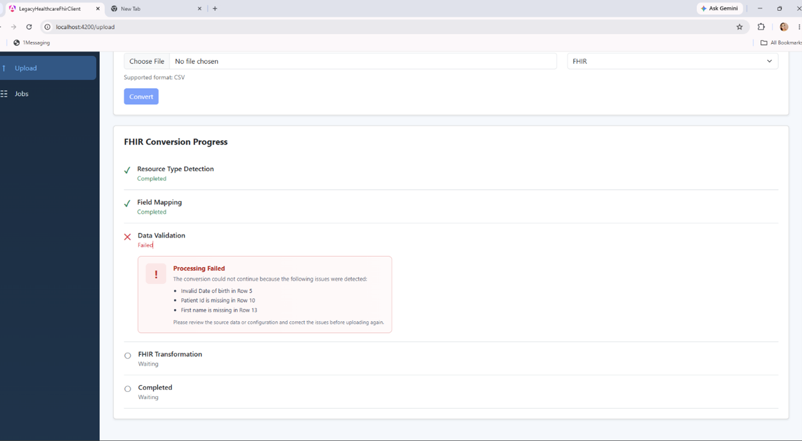
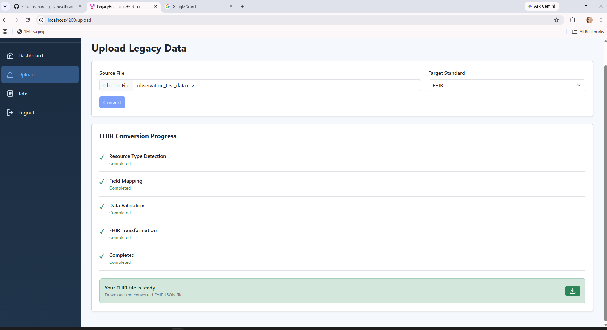

# Legacy Healthcare to FHIR Integration Framework

An AI-assisted healthcare data integration prototype that transforms legacy healthcare data into FHIR format.

The framework is designed as an API-based adapter that allows legacy healthcare systems to transform data into modern interoperability formats without requiring replacement of the existing source system.

## Problem

Many healthcare organizations continue to use legacy systems to store healthcare data. These systems may use different data structures, field names, and formats, making it difficult to exchange data with systems that use modern interoperability standards such as FHIR.

Replacing existing systems can also be expensive and time-consuming.

This prototype explores an adapter-based approach where legacy healthcare data can be identified, mapped, validated, and transformed into FHIR format.

## Prototype Objective

The objective of this prototype is to demonstrate an AI-assisted workflow for transforming legacy healthcare data into FHIR while keeping human review in the process.

AI is used to:

- Detect the likely FHIR resource type.
- Suggest mappings between legacy fields and normalized fields.

Users can review and correct AI suggestions before approving them.

Approved resource types and field mappings are stored using fingerprints so they can be reused when recognized again, reducing unnecessary AI calls.

Normalization, validation, and FHIR transformation are performed using deterministic application logic rather than AI.

## Current Prototype Scope

### Implemented

- Multi-hospital login and logout
- Hospital-specific user context
- CSV legacy data input
- FHIR R4 JSON output
- Patient resource transformation
- Observation resource transformation
- Encounter resource transformation
- AI-assisted FHIR resource type detection
- Human review and approval of detected resource types
- AI-assisted field mapping
- Human review and correction of field mappings
- Resource and field fingerprinting
- Reuse of previously approved configurations
- Data normalization
- Data validation
- Background job processing
- Real-time job progress notifications
- Dashboard with aggregated job information and recent jobs
- Job history page
- FHIR output download
- Temporary source-file cleanup after successful processing

### Future Extensions

The architecture is designed to allow additional capabilities to be added without changing the core processing workflow.

Potential extensions include:

- HL7 v2 input/output
- XML and C-CDA support
- Additional FHIR resource types
- Additional FHIR validation and profile support
- Production-grade authentication and authorization
- Enterprise identity and SSO integration

## Processing Workflow

The transformation process runs as a background job through the following stages:

```text
Legacy File Upload
        ↓
Resource Type Detection
        ↓
Human Review / Approval
        ↓
Field Mapping
        ↓
Human Review / Approval
        ↓
Normalization & Validation
        ↓
FHIR Transformation
        ↓
FHIR JSON Output
        ↓
Completed / Source File Cleanup
```

### Resource Type Detection

The system analyzes the structure of the uploaded legacy file to determine the likely FHIR resource type.

A fingerprint is generated from the source structure. If a previously approved resource type exists for the recognized fingerprint, the approved configuration is reused and the AI call is skipped.

If no approved configuration exists, AI suggests a FHIR resource type such as Patient, Observation, or Encounter.

The user can review, change, and approve the suggested resource type.




### Field Mapping

After resource type approval, legacy fields are mapped to normalized fields.

For example:

```text
F_NAME     → FirstName
L_NAME     → LastName
DOB        → DateOfBirth
SEX        → Gender
```

Previously approved field mappings can be reused when recognized.

If a mapping is not already available, AI suggests a mapping and the user can review or correct it before approval.




### Normalization and Validation

Approved mappings are used to convert legacy records into a common internal representation.

For example, different source fields representing the same information can be converted into the same normalized field.

The normalized data is then validated.

If validation fails, processing stops and validation errors are returned to the user.




### FHIR Transformation

After successful validation, normalized data is transformed into FHIR R4 resources using deterministic transformation logic.

The generated FHIR resources are serialized into JSON and saved as the job output.


### Completion

After transformation is completed:

- The job is marked as completed.
- The uploaded legacy source file is removed.
- The generated FHIR output remains available for download.




## Architecture

The prototype is designed as an API-based healthcare data adapter.

The Angular web application provides a user interface for interacting with the adapter. The API layer also allows other applications or integration systems to interact with the transformation workflow without requiring the web interface.

The main components are:

- Angular Web Client
- ASP.NET Core Web API
- Background Job Processing
- AI Service
- Fingerprint and Mapping Configuration Storage
- Normalization and Validation Engine
- FHIR Transformation Engine
- SignalR Notification Service
- SQLite Database
- Local File Storage

See [Architecture Documentation](docs/architecture.md) for additional details.

## Technology Stack

| Component | Technology |
| --- | --- |
| Frontend | Angular / TypeScript |
| Node.js | 22.11.0 |
| Backend | .NET 10 / C# |
| API | ASP.NET Core Web API |
| Database | SQLite / Entity Framework Core |
| FHIR | Firely .NET SDK / FHIR R4 |
| Real-time Updates | SignalR |
| AI Integration | OpenAI API |

## Getting Started

### Prerequisites

Install:

- .NET 10 SDK
- Node.js 22
- Angular CLI
- Git

An OpenAI API key is required for AI-assisted resource type detection and field mapping.

### Clone the Repository

```bash
git clone https://github.com/Sanzoosunar/legacy-healthcare-fhir-framework.git
cd legacy-healthcare-fhir-framework
```

### Backend Setup

Navigate to the backend project:

```bash
cd LegacyHealthcareFHIR/LegacyHealthcareFHIR.Web
```

Restore the required packages:

```bash
dotnet restore
```

Configure the required application settings and OpenAI API credentials.

Run the backend:

```bash
dotnet run
```

### Frontend Setup

From the repository root, navigate to the Angular application:

```bash
cd legacy-healthcare-fhir-client
```

Install the required packages:

```bash
npm install
```

Run the Angular application:

```bash
ng serve
```

Open the application at:

```text
http://localhost:4200
```

## Demo Accounts

The prototype automatically seeds three demonstration hospitals and three demo users when the application starts.

| Username | Password |
| --- | --- |
| demo1 | demo1 |
| demo2 | demo2 |
| demo3 | demo3 |

Each demo user is associated with a demonstration hospital.

These accounts are intended only for local prototype demonstration and testing.

## Using the Prototype

1. Log in using one of the demo accounts.
2. Navigate to the Upload page.
3. Select a legacy CSV file.
4. Select FHIR as the target standard.
5. Start the conversion job.
6. Review the AI-suggested FHIR resource type.
7. Approve or change the resource type.
8. Review the AI-suggested field mappings.
9. Approve or correct the mappings.
10. The system normalizes and validates the data.
11. Valid data is transformed into FHIR R4.
12. Download the generated FHIR JSON after the job is completed.

Job progress can be monitored from the upload workflow, dashboard, and job list.

## Supported Data

### Source Format

Currently implemented:

- CSV

### Target Format

Currently implemented:

- FHIR R4 JSON

### FHIR Resources

Currently implemented:

- Patient
- Observation
- Encounter

Other source formats, target standards, and FHIR resources are outside the current prototype implementation.

## Prototype Testing

The prototype has been manually tested using sample legacy healthcare CSV files.

Testing covers scenarios such as:

- Patient conversion
- Observation conversion
- Encounter conversion
- Resource type detection
- Field mapping
- Human correction and approval
- Fingerprint and approved configuration reuse
- Validation failure
- Background job progress
- FHIR JSON generation
- Output download
- Source-file cleanup
- Multi-hospital login

See [Prototype Testing](docs/testing.md) for the test scenarios and results.

## Prototype Limitations

This repository contains a prototype and is not intended for production clinical use.

Current limitations include:

- CSV is the currently implemented legacy input format.
- FHIR R4 is the currently implemented output format.
- FHIR transformation currently supports Patient, Observation, and Encounter.
- Authentication is simplified for prototype demonstration.
- Demo hospitals and users are automatically seeded for testing.
- Production security, auditing, deployment, scalability, and operational controls are outside the current prototype scope.

## Repository Structure

```text
legacy-healthcare-fhir-framework/
│
├── LegacyHealthcareFHIR/
│   ├── LegacyHealthcareFHIR.Web/
│   ├── LegacyHealthcareFHIR.Core/
│   └── LegacyHealthcareFHIR.Infrastructure/
│
├── legacy-healthcare-fhir-client/
│
├── docs/
│   ├── architecture.md
│   ├── testing.md
│   └── images/
│
└── README.md
```

## Development Workflow

Development is tracked using GitHub Issues and pull requests.

Features and changes are implemented incrementally and merged through the repository's pull request workflow.

Planned capabilities are kept separate from functionality implemented in the current prototype.

## Disclaimer

This project is a prototype intended to demonstrate an approach to AI-assisted legacy healthcare data transformation and interoperability.

It is not intended for production clinical use.